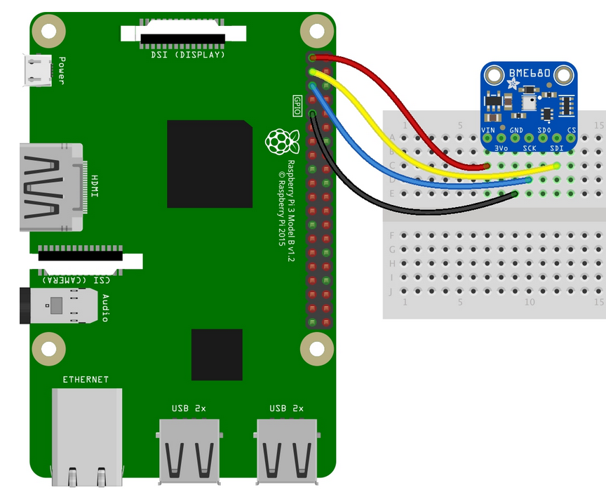

# Purpose
Provision a Raspberry Pi4 with the tools necessary to record humidity and display historical humidity via a web interface  

## Overview
The complete process is as follows:
- Flash an SD card with Ubuntu Server 20.04
- Copy and paste the "bootstrap" script
- Copy and paste the "prepare_pi.sh script
- Run an Ansible Playbook main_pull.yml

## Requirements
This project has been tested on a Raspberry Pi3 and Raspberry Pi4  
In this project I am using a BME 680 sensor for the humidity readings  
I've successfully used the BME 280 and may publish another playbook for that sensor in the future
## Variables 
Users of this repository will have to add thier own:
- sender_email, receiver_email, email password <- for email notifications of low humidity  
- SSH key
- zip code
- openweathermap API key

These can all be configured in 
- roles/common/vars/main.yml  

# Project Steps
## Prepare the Raspberry Pi
Download Ubuntu Server on the Pi  
Here is a tutorial from Canonical [Install Ubuntu Server on the Pi](https://ubuntu.com/tutorials/how-to-install-ubuntu-on-your-raspberry-pi#1-overview) which lays-out all the steps needed.
It is important to add a file named 'ssh' to the boot partition to SSH into the device
After the SD card is formatted and Ubuntu Server is installed, insert the SD card into the Pi, connect an ethernet cable and power the Pi on.
## Determine the IP Address
There are many ways to determine the IP address of the Pi
I find mine with the help of my DHCP server on my pfSense firewall
When you find the IP address you can SSH into the device-this example uses the address of 192.168.1.11:
```bash
ssh ubunut@192.168.1.11
```
When prompted, the password is 'ubuntu'  
The first time you log into the device, Ubuntu requres a password change from the default.  
Complete the process of changing the default password and log in again to the Pi  

## Update the OS and configure the Pi
The Pi needs some parameters changed to be able to receive the playbook.
To accomplish this, copy and paste the bootstrap.sh file to a newly created file on the Pi.  
But first we need to become the root user on the Pi:
```bash
sudo su
```
Then using your favorite text editor, I'm using nano here, create a file named 'bootstrap.sh':
```bash
nano bootstrap.sh
```
Copy the contents of [bootstrap.sh](files/bootstrap.sh) and paste them into the new 'bootstrap.sh' file on the Pi.    
----------> Be sure to insert your SSH key into the variables <-----------  
Save the file with 'CTRL-X' then 'y' then 'ENTER'.  

Next we need to make the file executable.  To do so:
```bash
chmod +x bootstrap.sh
```
Now we can run the first of the two 'setup' scripts on the Pi:
```bash
./bootstrap.sh
```

## Possible Issue you may encounter
If you see this:
```
Waiting for cache lock: Could not get lock /var/........etc
```
While the Pi is trying to update, Ubunutu may be updating in the background.  There are a few ways to fix this but one that works every time is to wait until that process is finished and restart the boostrap.sh script.  I have seen this take as long as 15 minutes-it is usually closer to 10 though.

## Install GIT and Ansible
The last command of bootstrap.sh reboots the Pi so we have to reconnect to the Pi this time using the new username 'ansible':
```bash
ssh ansible@192.168.1.11
```
We have one more script to cut and paste.  This will allow us to import the repository and run the playbook.  
Create a new file named 'prepare_pi.sh':
```bash
sudo nano prepare_pi.sh
```
Copy the contents of [prepare_pi.sh](files/prepare_pi.sh) and paste them into the new 'prepare_pi.sh' file on the Pi.
Save the file with 'CTRL-X' then 'ENTER'.  
We need to make this file executable:
```bash
sudo chmod +x prepare_pi.sh
```
Now run the second of the two 'setup' scripts on the Pi:
```bash
./prepare_pi.sh
```
The last command in the script will have the Pi reboot again.  
## Clone the repository
We are finally ready to use Ansible to automate the remainder of the process.  To do so we need to grab the playbook from the repository.  
SSH into the device:
```bash
ssh ansible@192.168.1.11
```
Clone the repository:
```bash
git clone https://github.com/erevnitis/pi_humidity_server.git
```
## Configure variables required for the project to work
Edit pi_humidity_server/roles/pull/vars/main.yml
```bash
sudo nano ~/pi_humidity_server/roles/pull/vars/main.yml
```
Insert:
- OpenWeatherMap API Key
- Zip Code
- Sender Email
- Receiver Email
- Email Password
Save the changes to the file.

Change directory to the repository directory:
```bash
cd pi_humidity_server
```

Run the Ansible playbook main_pull.yml which will complete the configuration for the Pi:
```bash
ansible-playbook main_pull.yml
```

# Connect the BME680 Sensor to the GPIO pins on the Pi
To connect the sensor to the Pi follow this diagram:



## Create the first entry in the database
Reconnect to the Pi as it was rebooted at then end of the playbook:  
```bash
ssh ansible@192.168.1.11
```
## Just to make sure:

To ensure the Pi has rebooted, check the list of groups 'ansible' is a member of:

```bash
groups
```

What should be returned is  

```
wheel adm sudo i2c
```

If this is not the case, either reload the Pi or logout:

```bash
su ubunut
```

And log back in:

```bash
su ansible
```


The Pi has been configured to populate the database by taking readings every 20 minutes via cron but you can test the python script immediately and create the first database entry:

```bash
python3 get_humidity.py
```
# Create initial graphs
The Pi has been configured to create a graph each hour to display on the webpage.  
To create the first one:
```bash
python3 create_portrait_graph.py
```
and:
```bash
python3 create_landscape_graph.py
```
# Configure the database
If you need to make adjustments to the database you can use phpMyAdmin  
Navigate to the device IP address and '/phpmyadmin' for the homepage  
In this case it's at 192.168.1.11/phpmyadmin and here's what you should see:


username is 'ansible'  
password is 'khtelemacher'  

# View webpage
For the webpages to be displayed we need to tell Flask to start the service.  

Navigate to the flask directory:
```bash
cd ~/flask
```
Start the webserver:
```bash
python3 main_flask.py
```
Using a browser navigate to the Pi's IP address and port 5000  
In this example 192.168.1.11:5000 and we should see this:

 